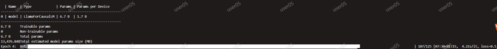

# *Confucius*

Iterative Tool Learning from Introspection Feedback by Easy-to-Difficult Curriculum


## Introduction

Augmenting large language models (LLMs) with external tools has emerged as a promising approach to extending the capability of LLMs. Although some works employ open-source LLMs for the tool learning task, most of them are trained in a controlled environment in which LLMs only learn to execute the human-provided tools.

However, selecting proper tools from the large toolset is also a crucial ability for the tool learning model to be applied in real-world applications. Existing methods usually directly employ self-instruction methods to train the model, which ignores differences in tool complexity. In this paper, we propose the ***Confucius***, a novel tool learning framework to train LLM to use complicated tools in real-world scenarios


## Methodology

In this paper, we propose the ***Confucius***,  a tool-learning framework to train LLM to use complicated tools in real-world scenarios. \ours contains two main phases:

1. In order to tackle the first challenge, we first propose a multi-stage learning method to teach the LLM to use various tools from an easy-to-difficult curriculum;
2.  We propose an **Iterative Self-instruct from Introspective Feedback** (ISIF) technique to dynamically construct the dataset to improve the ability to use the complicated tool.


## Dataset

### Data description
```json
{   
  "api": "The api for solve the specific task",
  "number": "The number for calling API",
  "prompt": "The prompt for generating this example",
  "task": "The task name",
  "question": "The specific query based on the API in the this task",
  "_answer": "The solution to solve problem in the format of chain of thought (COT), where the above APIs are called back"
}
```
A concrete example:

```json
{
    "api": [
        [
            "CAL",
            "expression: 2500/5",
            "CAL(expression: e)->float: calculate the result of expression `e`, e.g. 1+2, 1/3, 4*5 and 7-1."
        ],
        [
            "CAL",
            "expression: 2*%s1",
            "CAL(expression: e)->float: calculate the result of expression `e`, e.g. 1+2, 1/3, 4*5 and 7-1."
        ],
        [
            "CAL",
            "expression: %s2-200",
            "CAL(expression: e)->float: calculate the result of expression `e`, e.g. 1+2, 1/3, 4*5 and 7-1."
        ]
    ],
    "number": 3,
    "prompt": "According to the ratio, for every 5 parts that Johnson gets, Mike gets 2 parts.Since Johnson got $2500, each part is therefore $2500/5 = $<<2500/5=500>>500.Mike will get 2*$500 = $<<2*500=1000>>1000.After buying the shirt he will have $1000-$200 = $<<1000-200=800>>800 left. ### 800",
    "question": "The profit from a business transaction is shared among 2 business partners, Mike and Johnson in the ratio 2:5 respectively. If Johnson got $2500, how much will Mike have after spending some of his share on a shirt that costs $200?",
    "_answer": "According to the ratio, for every 5 parts that Johnson gets, Mike gets 2 parts. Since Johnson got $2500, each part is therefore [CAL(2500/5) -> %s1].Mike will get 2*$%s1 = [CAL(2*%s1) -> %s2]. After buying the shirt, he will have $%s2-$200 = [CAL(%s2-200) -> %s3] left. ### 800",
    "task": "calculation"
}
```


### How to Download?
The full dataset [[Click Here]](https://drive.google.com/drive/folders/1Q0BYalic9XkQZYz8yHTBazfBl9MSydFS?usp=sharing) has been shared on the Google Drive. We provide the different scales of training datasets, including `small`, `middle`, and `large` scales (further extended).

The dataset contains all the toolset in our work. For the evaluation of `unseen` setting in our work, you should remove the tools in the test dataset, which evaluate the generalizability of the model.  


## How to Reproduce?

### Environment Set up

1. python 3.9 
2. pytorch lightning (1.9.0)
3. Deepspeed (deepspeed in pytorch lightning)
4. transformer (install from source)
5. pytorch (torch 1.11)
6. tqdm
7. openai (only for collecting data)

We optimize the model using deepspeed ZeRO-three  strategy with the learning rate of $5e^{-5}$ and the weight decay coefficient of 0.01.
The training of our model can be done within 20 hours with **4 NVIDIA A100-PCIE-80GB GPUs**.


## Train

We mainly use the `pytorch-lightning` library and `transformers` library to train our models. We also employ the `deepspeed` library to accelerate the training process.

See the following specific commands.

```txt
torchrun --nnodes <num of machine> --nproc_per_node <number of device per machine>  --master_port <port>  \
train.py --per_device_train_batch_size <batch size> \
      --num_device_per_node <number of device>  \
      --num_works   \
      --strategy <strategy for speeding > \
      --gradient_accumulation_steps <16 for default> \
      --model_name_or_path <huggingface model path > \
      --train_data_path <data path for training (json/jsonl format)> \
      --warmup <int, see our paper for derails> \
      --in_catefory <int, see our paper for derails> \
      --cross_catefory <int, see our paper for derails> 
```

Please replace the command `args` with your own setting. Here is an example.


```txt
torchrun --nnodes 1 --nproc_per_node  4  --master_port 9994 \
 main.py --per_device_train_batch_size 4 \
      --num_device_per_node 4 \
      --num_works 10 \
      --gradient_accumulation_steps 32 \
      --model_name_or_path llama \
      --train_data_path   ../train.v4.151074.json  \
      --output_dir  \
      --naive 0 --in_category 5000 --cross_category 5000 \
      --max_epochs 25 \
```

the successful runing state is:



To update the dataset, you can use the `update` function in our code to select the tool-use examples that the model struggles to answer. And use these selected examples to construct more similar examples via SELF-Instruct.

## Inference

For the ChatGPT or Davinci-text-003 (now deprecated), you can directly call the OpenAI API to following the setting of our work.
For the Open-source models, we use the weight downloaded from huggingface platform and use the `transformers` library for the inference.  And the successful runing state is:


# Citation

```text
 @inproceedings{gao2023confucius,
    title={Confucius: Iterative tool learning from introspection feedback by easy-to-difficult curriculum}, 
    author={Gao, Shen and Shi, Zhengliang and Zhu, Minghang and Fang, Bowen and Xin, Xin and Ren, Pengjie and Chen, Zhumin and Ma, Jun},
    booktitle={Proceedings of the AAAI Conference on Artificial Intelligence},
    year={2024}
}
```

